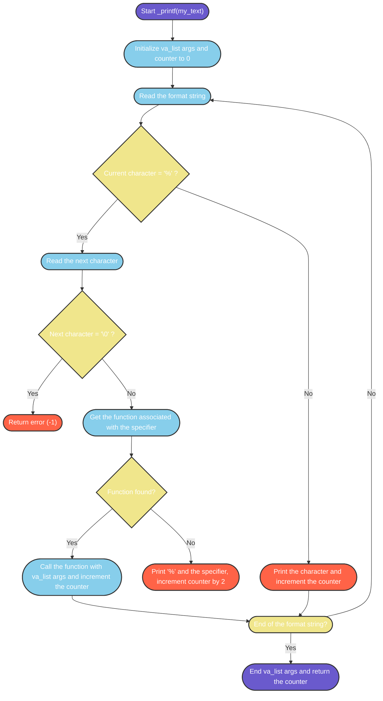

# Printf

Hello, welcome to our first group project, we're replicating the printf() function from the C Standard Library.

## Contenu

**main.h** : Header file linking all files together.

**\_printf.c** : Main trunk of my printf function.

**\_putchar.c** : Writes characters to standard output.

**print_char.c** : Prints characters.

**print_int.c** : Prints digits.

**print_percent.c** : Prints the '%' symbol.

**print_string.c** : Prints strings.

**README.md** : You are currently reading it.

## Betty coding style:

All files are written in C and follows the Betty coding style for Holberton School. For more detail, check this page:

[Betty style documentation](https://github.com/holbertonschool/Betty/wiki)

## Project specifications

- No allowed to use global variable
- No more than 5 functions per file
- All files end with a new line

### Specifiers

Specifier characters define the type and the interpretation of its corresponding argument:

| Specifier  |     Output     |
| ---------- | -------------- |
| `c`        | character      |
| `s`        | string         |
| `d` or `i` | Signed integer |
| `%`        | %              |

## Flowchart



## Prerequisites

To compile and run these programs, you'll need a C compiler (e.g. gcc).

## Compiling and executing

To compile and execute this program, use the following command:

```bash
git clone https://github.com/Basco64/holbertonschool-printf.git
```

```
cd holbertonschool-printf
```

```
gcc *.c -o prog && ./prog
```

## Examples

Displaying a string :

Source code :

```c
#include "main.h"

int main() {
    _printf("String:[%s]\n", "I am a string !");
    return 0;
}
```

Expected release:

```
String:[I am a string !]
```

You can have fun performing many more tests like that:

```c
#include "main.h"

int main() {
    int num = 5;
    char* str = "cumulonimbus";
    char* adjective = "magnificient";

    _printf("I see %d %s %s in the sky !", num, adjective, str);

    return 0;
}
```

Expected release:

```
I see 5 magnificent cumulonimbus in the sky !
```

## Author

This project was created by **[Clément Chassemon](https://github.com/UsagerLambda)** and **[Xabi Martinez](https://github.com/Basco64)** for the Holberton School.


## Acknowledgements

_Thanks to Holberton School for their support._
